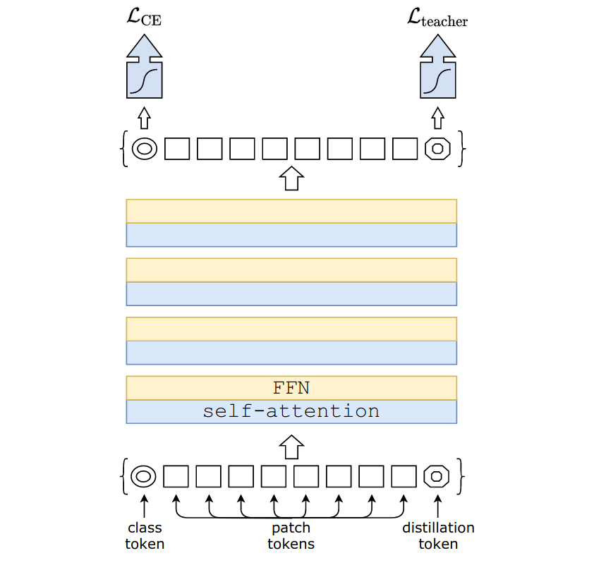
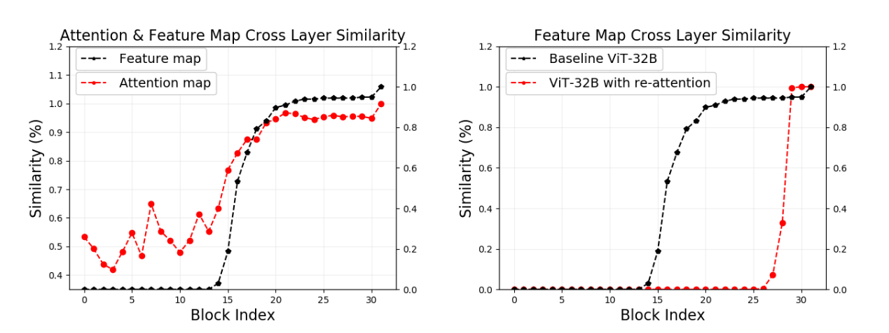
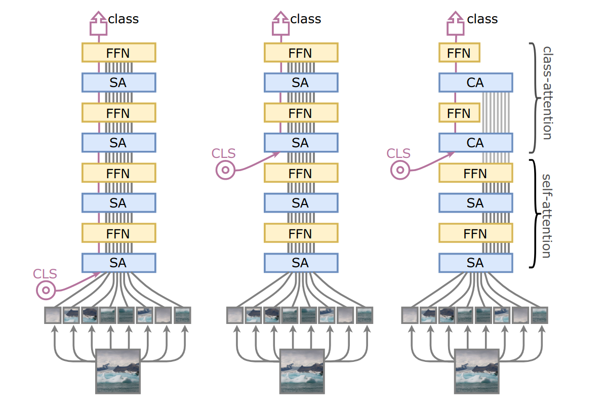
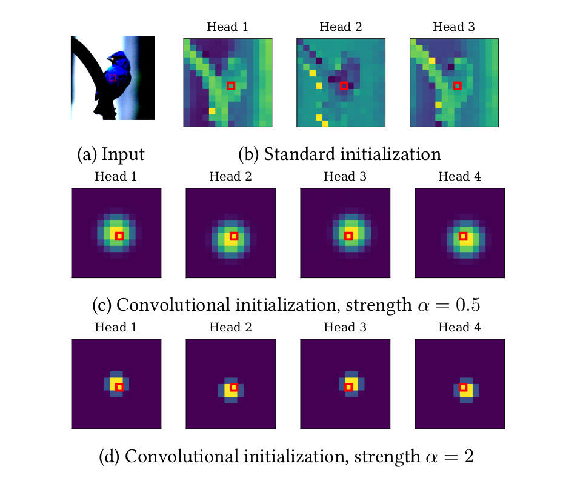

```{r setup, include=FALSE}
knitr::opts_chunk$set(echo = FALSE)
```

## Introduction

Initially introduced with the now-famous [**Attention is all you need**]((https://arxiv.org/abs/1706.03762))[@transformer], the Transformer has dominated the field of Natural Language Processing (NLP) for years. Particularly worth noting is the effort gone into scaling up Transformer-based models, such as [BERT](https://doi.org/10.18653/v1/n19-1423)[@bert], [MegatronLM](http://arxiv.org/abs/1909.08053)[@megatron], [T5](http://jmlr.org/papers/v21/20-074.html)[@t5], and the various GPTs ([GPT](https://openai.com/blog/language-unsupervised/)[@gpt], [GPT-2](https://openai.com/blog/better-language-models/)[@gpt2] and [GPT-3](https://proceedings.neurips.cc/paper/2020/hash/1457c0d6bfcb4967418bfb8ac142f64a-Abstract.html)[@gpt3]), due to their favourable scaling characteristics[@neural_laws1; @neural_laws2].

The success of transformers in NLP has not gone unnoticed in other fields, where they have been responsible for significant breakthroughs such as [AlphaFold 2](https://deepmind.com/blog/article/alphafold-a-solution-to-a-50-year-old-grand-challenge-in-biology) in the field of protein folding.

Important works adapting transformers (and self-attention) to vision include [Attention Augmented Convolutional Networks](https://doi.org/10.1109/ICCV.2019.00338)[@aacn], [Stand-Alone Self-Attention models](https://proceedings.neurips.cc/paper/2019/hash/3416a75f4cea9109507cacd8e2f2aefc-Abstract.html)[@sasa] (SASA models), [DETR](https://link.springer.com/chapter/10.1007/978-3-030-58452-8_13)[@detr], [Visual Transformers](https://arxiv.org/abs/2006.03677)[@visual_transformer] and [LambdaNetworks](https://arxiv.org/abs/2102.08602)[@lambda]; as well as [Image Transformers](http://proceedings.mlr.press/v80/parmar18a.html)[@image_transformer] and [Axial Transformers](http://arxiv.org/abs/1912.12180)[@axial] in the generative domain.

For an in-depth introduction to these works, we recommend two recent reviews: [**A Survey in Visual Transformers**](https://arxiv.org/abs/2012.12556)[@survey1] and [**Transformers in Vision: A Survey**](https://arxiv.org/abs/2101.01169)[@survey2].

## Overview

This blog post aims to summarize recent research in applying transformers and self-attention to vision, with a focus on (but scope not limited to) image classification. While by no means exhaustive, it can hopefully represent a starting point for a more in-depth dive into the literature.

We first introduce the Vision Transformer, a simple yet powerful architecture that has had a significant influence on recent research due to its performance in large data regimes. We then continue with the many works studying how to achieve similar high performance using transformers (and self-attention) when data is not as plentiful. Finally, we discuss papers studying the robustness of these models to perturbations as well as their performance in self-supervised, medical and video tasks.

Figures are taken from their respective papers unless the source is explicitly provided in the caption.

Before we begin, it is worth noting that familiarity with transformers and self-attention is recommended; great resources include Jay Alammar's [Illustrated Transformer](http://jalammar.github.io/illustrated-transformer/) and Peter Bloem's [Transformers from scratch](http://peterbloem.nl/blog/transformers). For high-quality implementations of many models discussed in this post, check out Ross Wightman's [PyTorch Image Models](https://github.com/rwightman/pytorch-image-models) as well as [Phil Wang's work](https://github.com/lucidrains/).

### An image is worth 16x16 words: the Vision Transformer

First introduced in [**An Image is Worth 16x16 Words: Transformers for Image Recognition at Scale**](https://openreview.net/forum?id=YicbFdNTTy)[@vit], Vision Transformers (ViTs) have taken computer vision by storm, leading to hundreds of citations in the span of a few months. The paper's main goal was to show that a vanilla Transformer, once adapted to deal with data from the visual domain, could compete with some of the most performant convolutional neural networks (CNNs) developed up to that point.

The Vision Transformer architecture is conceptually simple: divide the image into patches, flatten and project them into a $D$-dimensional embedding space obtaining the so-called patch embeddings, add positional embeddings (a set of learnable vectors allowing the model to retain positional information) and concatenate a (learnable) class token, then let the Transformer encoder do its magic. Finally, a classification head is applied to the class token to obtain the model's logits.

<center>
```{r fig.cap="A Vision Transformer classifying an image. [Source.](https://ai.googleblog.com/2020/12/transformers-for-image-recognition-at.html)"}
knitr::include_graphics("ViT.gif")
```
</center>

The model's performance was acceptable when trained on ImageNet ($1$M images), great when pre-trained on ImageNet-21k ($14$M images), and state-of-the-art when pre-trained on Google's internal JFT-300M dataset ($300$M images).

The striking performance improvement was due to the reduced inductive bias that characterizes Vision Transformers. By making fewer assumptions about the data, Vision Transformers could better adapt themselves to the given task. However, this ability came at a cost -- when the sample size was too small (such as in the ImageNet case), the models overfit, resulting in degraded performance.

The goal for many follow-up papers would be that of matching (and surpassing) the performance of the best convolutional models in the "small" data regime -- ImageNet (which is after all over a million images) and below.

### Stronger data augmentation allows more efficient learning

[**Training data-efficient image transformers & distillation through attention**](https://arxiv.org/abs/2012.12877)[@deit] was the first paper to show that models based on ViTs could be competitive on ImageNet without access to additional data. 

The paper has two main contributions:

* A novel training recipe (referred to below as the DeiT recipe), characterized by more substantial data augmentation and stochastic depth[@depth]. These changes introduce additional regularization limiting ViT's tendency to overfit in the small data regime, thus boosting its performance. The authors recommend the use of Rand-Augment[@randaugment], Mixup[@mixup], CutMix[@cutmix], and Random Erasing[@randerasing]; they also recommend not to use DropOut[@dropout].
* Hard-label distillation. In this approach, an additional learnable token, called the distillation token, is concatenated to the patch embeddings. The model is then trained with the loss function $$\mathcal{L}_{hardDistill}=\frac{1}{2}\mathcal{L}_{CE}(\sigma(Z_{cls}), y_{true}) + \frac{1}{2}\mathcal{L}_{CE}(\sigma(Z_{distill}), y_{teacher})$$ where $\mathcal{L}_{CE}$ is the cross-entropy loss function, $\sigma$ is the softmax function, $Z_{cls}$ and $Z_{distill}$ are the student model's logits derived respectively from the class and distillation tokens, and $y_{true}$ and $y_{teacher}$ are respectively the true and the teacher's hard labels. This distillation technique allows the model to learn even when the combination of multiple strong data augmentations causes the provided label to be imprecise, as the teacher network will produce the most probable label. Interestingly, the authors found CNNs to be better teacher networks than other Vision Transformers.

<center>
```{r, out.width = "100%", fig.cap = "The Data efficient image Transformer hard-label distillation procedure."}

```
</center>

The resulting models, called Data efficient image Transformers (DeiTs), were competitive with EfficientNet on the accuracy/step time trade-off, proving that ViT-based models could compete with highly performant CNNs even in the ImageNet data regime. It is however worth noting that DeiTs performed much worse than [EfficientNets](http://proceedings.mlr.press/v97/tan19a.html)[@efficientnetv1] in terms of accuracy/parameters and accuracy/FLOPs.

### Incorporating relative Self-Attention in ResNet design

[**Bottleneck Transformers for Visual Recognition**](https://arxiv.org/abs/2101.11605)[@botnet] investigated a family of hybrid convolution and attention models obtained by incorporating  Multi-Head Self-Attention (MHSA) in ResNet designs. In particular, the authors showed that by simply replacing the $3\times 3$ convolutions with relative position MHSA layers in the bottleneck blocks of the last stage of a ResNet, it was possible to obtain an improvement over several baselines.

Once additional bells-and-whistles were added, such as [Squeeze-and-Excite layers](https://openreview.net/forum?id=ryE2Slzu-B)[@se] and [SiLU non-linearities](https://arxiv.org/abs/1702.03118v3)[@silu], the models (that the authors call Bottleneck Transformer Networks or BoTNets) demonstrated favorable scaling, outperforming EfficientNets in the accuracy/step-time trade-off beyond 83% top-1 accuracy. The worse performance of small BoTNet models could be due to the fact that the authors do not employ the DeiT training recipe to combat overfitting.

Further, the use of ResNet blocks in the initial stages to efficiently learn lower resolution feature maps allowed the models to perform well in both instance segmentation and object detection tasks, where high-resolution images are typical.

### Conditional Positional Encodings

[**Conditional Positional Encodings for Vision Transformers**](https://arxiv.org/abs/2102.10882)[@conditional] studied alternatives to the positional embeddings and class token used in ViTs. In particular, the paper proposes the use of Positional Encodings Generators (PEGs), a module that produces positional encodings dynamically, and the use of global average pooling as an alternative to the (non-translation-invariant) class token.

PEGs reshape the flattened input sequence to 2D, apply a series of convolutional layers (the authors use depthwise separable convolutions) with zero-padding, and flatten the result. Positional information is thus introduced by the presence of zero-padding, unlike in ViTs, where 1D learnable positional embeddings are used. The method has two main advantages:

* The model is now translation invariant.
* The model can now be used as-is on higher resolutions, unlike normal ViTs that require rescaling of the positional embeddings before fine-tuning.

<center>
```{r out.width = "100%", fig.cap = "The Positional Encoding Generator (PEG) module architecture."}
knitr::include_graphics("conditional.png")
```
</center>

The resulting models, called Conditional Positional Encoding Vision Transformers (CPVTs), are trained with the DeiT recipe and obtain a small boost in performance (particularly when tested on higher resolution images without fine-tuning).

### Modeling the local patch structure

[**Transformer in Transformer**](https://arxiv.org/abs/2103.00112)[@tnt] (TNT) studied the importance of intra-patch structure by introducing an additional transformer block, dedicated to pixel embeddings, inside the transformer blocks used in ViT.

<center>
```{r out.width = "100%", fig.cap = "The Transformer in Transformer (TNT) architecture."}
knitr::include_graphics("tnt.png")
```
</center>

The output of the inner transformer block is both sent as-is to the next layer and adapted for use in the outer transformer block which can now take into account both inter patch relationships (like  ViT does) and intra-patch structure. The authors also introduced a separate set of positional embeddings, added to the pixel embeddings before entering the encoder.

The models, trained with the DeiT recipe, outperformed both ViTs and DeiTs on ImageNet, achieving higher parameter and FLOP efficiency, although not quite as high as EfficientNet's.

### Deeper and deeper with Vision Transformers

[**DeepViT: Towards Deeper Vision Transformer**](https://arxiv.org/abs/2103.11886)[@deepvit] investigated how the performance of ViTs changed with increasing depth. After 24 transformer blocks, the authors discovered that adding additional blocks did not lead to improved performance, as both the feature maps and the attention matrices end up being remarkably similar to each other, a problem they name Attention Collapse.

To solve this issue, the authors proposed a simple variant of self-attention that they call Re-Attention, characterized by a learnable transformation matrix $\Theta \in  R^{H \times H}$ (where $H$ is the  number of attention heads) applied directly after the softmax. This matrix (which is shared throughout the network but that can also be layer-specific) allows the model to establish cross-head communication, diminishing inter-layer feature map similarity.

The authors also reported positive results following an approach similar to the one proposed in [LazyFormer](https://arxiv.org/abs/2102.12702)[@lazy]: reusing the attention matrix for the last half of the network caused no degradation in performance.

<center>
```{r out.width = "100%", fig.cap = "Attention and feature map cross layer similarity (left); ViT and DeepViT comparison (right)."}

```
</center>

The resulting models, called Deep Vision Transformers (DeepViTs), are characterized by better performance as depth increases.

[**Going deeper with Image Transformers**](https://arxiv.org/abs/2103.17239)[@cait] identified two main issues in DeiT models: the lack of performance improvement (and even performance degradation) at increased network depth and the double objective that characterizes the transformer encoder, which has to model both inter-patch relationships as well as that between the class token and the patch embeddings. To demonstrate the latter, the authors show that a DeiT where the class token is inserted later on in the network outperforms a normal DeiT.

Two main contributions characterize the paper:
* LayerScale, a novel normalization strategy applied to residual branches. 
* Class-attention layers, a layer dedicated to the efficient extraction of information relevant to the classification task from the processed patch embeddings.

LayerScale is characterized by a layer-specific set of learnable diagonal matrices, whose diagonal values are initialized to a small $\epsilon$, applied to the output of every residual branch. It is conceptually similar to methods like [FixUp](https://openreview.net/forum?id=H1gsz30cKX)[@fixup] and [SkipInit](https://openreview.net/forum?id=wmqLC6f5ens)[@skipinit] but provides the model with more freedom since it is per-channel (unlike other methods that only use a single scalar).

As mentioned before, Class-attention layers allow efficient extraction of information from processed patch embeddings. The authors find it a better alternative than the simple late-stage insertion of the class token and global average pooling, achieving the same accuracy with lower computational costs.

<center>
```{r out.width = "100%", fig.cap = "ViT (left), late class token ViT (center) and CaiT (right)."}

```
</center>

The authors also proposed the use of additional bells and whistles, such as [Talking Heads Attention](https://arxiv.org/abs/2003.02436)[@talking].

The resulting models, called Class-attention image Transformers (CaiTs), achieved notable performance on the ImageNet benchmark. CaiTs even outperform the recent [NFNets](https://arxiv.org/abs/2102.06171)[@nfnet] in both the accuracy/parameters trade-off and the accuracy/FLOPs trade-off when using both the DeiT training recipe as well as the DeiT distillation technique.

### Convolutional insights

[**ConViT: Improving Vision Transformers with Soft Convolutional Inductive Biases**](https://arxiv.org/abs/2103.10697)[@convit] investigated the exciting possibility of initializing self-attention blocks with soft convolutional biases. Basing their work on studies regarding the [theoretical relationship between self-attention and convolutional layers](https://openreview.net/forum?id=HJlnC1rKPB)[@relationship], the authors introduced Gated Positional Self-Attention (GPSA), a variant of self-attention which is characterized by the possibility of being initialized with a locality bias.

More precisely, the initialization of a GPSA block is parameterized by a head-specific center of attention (the position to which the head pays most attention to, given the query patch) and a locality strength (which determines how focused every head is around its center of attention). GPSA blocks also employ a gating mechanism to better balance content and positional information. By appropriately setting the centers of attention and the locality strength of GPSA blocks, the model can compete with CNNs in the low data regime and at the same time enjoy ViT-like expressive power in large data regimes. 

<center>
```{r, out.width="100%", fig.cap = "Input image (top left), attention maps of an untrained SA block (top right) and GPSA blocks (center and bottom)."}

```
</center>

The authors demonstrated the effectiveness of this elegant approach through an empirical study comparing DeiTs to the resulting models, which they named Convolutional Vision Transformers (ConViTs): on ImageNet ConViTs enjoy progressively superior performance as the sample size is diminished while retaining DeiT-like performance at full sample size.

Two more papers exploring the application of convolutional insights to Vision Transformers are [**Incorporating Convolution Designs into Visual Transformers**](https://arxiv.org/abs/2103.11816)[@ceit] and [**LocalViT: Bringing Locality to Vision Transformers**](https://arxiv.org/abs/2104.05707)[@localvit].

The first paper has three main contributions:
* The Image-to-Tokens (I2T) stem, substituting ViT's convolutional stem and characterized by the addition of a max-pooling operation followed by batch normalization.
* The Locally enhanced Feedforward block, substituting ViT's feedforward block and characterized by the use of depthwise convolutions and batch normalization.
* The Layer-wise Class-Token Attention, which is applied at the end of the network and attends unidirectionally to all class tokens throughout the network.

The authors adopted the DeiT training recipe; their models, called Convolution-enhanced image Transformers (CeiTs), obtained superior results against both same-size DeiT models and same-size distilled DeiT models.

The second paper also studied the application of depth-wise convolutions in the feedforward networks while ablating the use of different activation functions and the application of Squeeze-and-Excite layers.

The authors applied this approach to several models, obtaining favorable results.

### The importance of Hierarchy

Several papers have studied the application of a hierarchical structure to Vision Transformers.

[**Tokens-to-Token ViT: Training Vision Transformers from Scratch on ImageNet**](https://arxiv.org/abs/2101.11986)[@t2t] introduced the Token-to-Token module (T2T), a module that reshapes the input sequence to a 2D structure, applies a soft split (allowing overlapping patches), and flattens the resulting patches. By adjusting the patch size used in the module, the length of the token sequences diminishes progressively throughout the network.

*<p style="text-align: center;"> 
The Token-to-Token module</p>*

The authors obtained favorable results, with performance comparable to that of [MobileNets](https://ieeexplore.ieee.org/document/8578572)[@mobile].

[**Pyramid Vision Transformer: A Versatile Backbone for Dense Prediction without Convolutions**](https://arxiv.org/abs/2102.12122)[@pvt] introduced a variant of Self-Attention called spatial-reduction attention (SRA), characterized by spatial reduction of both keys and values. By applying SRA at the end of several stages, the spatial dimensions of the feature map slowly decrease throughout the model. The resulting models, called Pyramid Vision Transformers (PVTs), can deal with a variety of tasks, including dense prediction, object detection, and semantic segmentation, where high-resolution images are typical.

*<p style="text-align: center;"> 
The Pyramid Vision Transformer.</p>*

[**Scalable Visual Transformers with Hierarchical Pooling**](https://arxiv.org/abs/2103.10619)[@hvt] explored the use of max-pooling to diminish the sequence length progressively.  The authors also replaced the class token used in ViT with a final global average pooling layer. The resulting models, called Hierarchical Vision Transformers (HVTs), are trained with the DeiT recipe and scaled up (in the embedding dimension and number of heads) to have a comparable computational cost to DeiTs, achieving gains in the low (sub $5$) GFLOPs regime.

[**Swin Transformer: Hierarchical Vision Transformer using Shifted Windows**](https://arxiv.org/abs/2103.14030)[@swin] suggested a different route: use local self-attention inside (non-overlapping, local) windows, allow cross-window communication through so-called *shifted window partitioning*, and produce a hierarchical representation by progressively merging the windows themselves. 


*<p style="text-align: center;">
The Swin Transformer shifted window partitioning.</p>*

In the last stage of the network, all local windows have been merged, resulting in blocks effectively using global self-attention on a feature map whose spatial dimensions have been significantly decreased. It's worth noting that this approach scales linearly with image size.

*<p style="text-align: center;">
Swin Transformer (left) and ViT (right). Attention is applied on patches (black) inside windows (red).</p>*

The authors also reported positive results applying T5-style relative positional bias in attention blocks and obtained promising results both on ImageNet and ImageNet-21k, as well as in object detection and semantic segmentation tasks.

[**Rethinking Spatial Dimensions of Vision Transformers**](https://arxiv.org/abs/2103.16302)[@pit] introduced a novel pooling layer, characterized by a depthwise convolution (for patch embeddings) and a fully connected layer (for the class token). This simple change allowed the models, named Pooling-based vIsion Transformers (PiTs), to outperform vanilla Vision Transformers in the ImageNet data regime.

[**LeViT: a Vision Transformer in ConvNet’s Clothing for Faster Inference**](https://arxiv.org/abs/2104.01136)[@levit] studied a hybrid architecture characterized by a longer convolutional stem and shrink attention blocks that progressively diminish the spatial dimensions of the feature maps throughout the network. The authors also proposed the use of global average pooling instead of the class token, the injection of positional information through attention bias, and the addition of a [GELU activation](https://arxiv.org/abs/1606.08415)[@gelu] in the attention block.

The authors named the models LeViTs, trained them using both the DeiT training recipe and the DeiT distillation procedure, and showed that the networks are capable of high-speed inference, outperforming EfficientNets and DeiTs in the accuracy/step-time trade-off, on both GPU and CPU.

### Multi-Scale features and Cross-Attention

[**CrossViT: Cross-Attention Multi-Scale Vision Transformer for Image Classification**](https://arxiv.org/abs/2103.14899)[@crossvit] proposed the use of multi-scale features by adapting the Vision Transformer to have two branches:
* A large (or primary) one characterized by large patch size, deep transformer encoder, and wide embedding dimension.
* A small (or complementary) one characterized by smaller patch size, shallower encoder, and narrower embedding dimension.

The branches employ two separate class tokens. Late in the network (after a separate set of positional embeddings is added), cross-branch communication is established through the use of Cross-Attention Fusion blocks.

In particular, inside cross-attention fusion blocks, class tokens are concatenated to the patch embeddings of the other branch and processed by attention before being returned to their respective branch. 

*<p style="text-align: center;"> 
The Cross-Attention fusion layer for the large branch.</p>*

The output of MLP heads based on the large and small branches tokens is then added together to generate the model's logits.

The resulting models, which the authors named CrossViTs, are trained with the DeiT recipe and enjoy significant performance boosts, achieving better performance than DeiTs twice as large and twice as computationally expensive.

### Integrating convolutions in attention

[**CvT: Introducing Convolutions to Vision Transformers**](https://arxiv.org/abs/2103.15808)[@cvt] can be seen as a complementary approach to Bottleneck Transformers, where instead of using multi-head self-attention inside of a CNN's final blocks, convolutions (in this case, [depthwise separable ones](https://arxiv.org/abs/1610.02357)[@depthwise]) are used inside a Vision Transformer's self-attention blocks. More precisely, Convolutional vision Transformers (CvTs, whose full-name conflicts with ConViTs) are characterized by two main features:

* The Convolutional Token Embedding, a module characterized by a strided convolution and inserted at the beginning of every stage. 
* The Convolutional Projection(s) in the attention blocks. These projections, implemented through depthwise separable convolutions, allow queries, keys, and values to be influenced by neighboring tokens. Further, larger strides for keys and values diminish the tokens spatial dimensions, decreasing the associated parameters count and computational cost.

*<p style="text-align: center;"> 
The (strided) Convolutional Projections.</p>*

These two features allow the model to progressively reduce the tokens feature and spatial dimensions, allowing CvTs to adopt a hierarchical multi-stage architecture.

It's worth noting that CvTs do not employ positional embeddings since positional information is retained through the use of convolutions both in the embedding layers as well as in the attention blocks.

The authors adopted the original ViT training recipe and achieved competitive performance when training CvTs on ImageNet. The largest model presented (CvT-W24), once pre-trained on ImageNet-21k, obtained a stunning $87.7\%$ top-1 accuracy, outperforming BiT-L (an ensemble of CNNs pre-trained on $20$ times more data) with a fraction of parameters and compute.

[**Multi-Scale Vision Longformer: A New Vision Transformer for High-Resolution Image Encoding**](https://arxiv.org/abs/2103.15358)[@vil] introduced a 2D version of [Longformer](https://arxiv.org/abs/2004.05150)[@long], which the authors call Vision Longformer. Conceptually, it is characterized by two different sets of tokens: a set of global tokens,  allowed to attend to all tokens, and local tokens, only allowed to attend to global tokens and tokens spatially close to them.

*<p style="text-align: center;"> 
Global and local tokens in Multi-Scale Vision Longformers.</p>*

It's worth noting that, at least in vision-only tasks, global tokens are discarded at the end of every attention block (while local tokens are reshaped and passed to the next one), since they have at that point already fulfilled their role of allowing efficient communication between spatially distant tokens.

The authors adopted DeiT-style training and achieved impressive parameter and FLOP efficiency.

### Haloing and Strided local Self-Attention

[**Scaling Local Self-Attention for Parameter Efficient Visual Backbones**](https://arxiv.org/abs/2103.12731)[@halonet] builds on top of SASA models, by developing a local self-attention-only family of models made more efficient by the newly introduced haloing operation.

More precisely, the authors introduced a novel strategy called Blocked Self-Attention: input is first divided into blocks (which will be used as queries), and neighboring pixels are banded together and padded, in an operation denominated haloing, to generate keys and values. Finally, attention is applied.

*<p style="text-align: center;"> 
Blocked local Self-Attention as used in HaloNets.</p>*

It’s worth noting that this operation causes layers not to be translationally equivariant, but the authors took this route to obtain higher hardware utilization.

The network assumes a hierarchical structure thanks to a strided version of self-attention that is applied at the end of every stage (thus replacing SASA models post-attention average pooling).

The resulting models, called HaloNets, achieved extremely high parameter efficiency, slightly surpassing EfficientNets, a feat not obtained by any other model thus far. It’s worth, however, noting that HaloNets have a longer step-time, particularly when using larger configurations.

### Second-order pooling

[**So-ViT: Mind Visual Tokens for Vision Transformer**](https://arxiv.org/abs/2104.10935)[@sovit] recently proposed the use of second-order pooling to extract high-level information from visual tokens (that is all tokens apart from the class one). The model's logits are finally obtained by summing up the output of two separate linear heads, one applied to the class token, and one applied to the pooled features. 

*<p style="text-align: center;">
So-ViT architecture.</p>*

The resulting models, named Second-order ViTs (So-ViTs), are trained with an expanded DeiT recipe, and obtain competitive results.

### Comparison on Image Classification

Before continuing, we recap the reported performance of most models presented up to this point.

To provide a fair comparison, we only consider models trained at the same resolution ($224 \times 224$) apart from ViTs that were trained at $384 \times 384$. We also denote models fine-tuned at higher ($384\times384$) resolution with an upward arrow, and exclude models trained for more than $400$ epochs or using the DeiT hard-label distillation technique, because only the DeiT, T2T, and CaiT papers report results using it.

We follow [**An Analysis of Deep Neural Network Models for Practical Applications**](https://openreview.net/forum?id=Bygq-H9eg)[@canziani] in graphing ImageNet top-1 accuracy vs. FLOPs and parameter count. 

```{r, layout="l-page"}
htmltools::tags$iframe(
  src = "imagenet1k.html", 
  width="100%", 
  height="640",
  scrolling="no", 
  seamless="seamless", 
  frameBorder="0"
)
```

```{r, layout="l-page"}
htmltools::tags$iframe(
  src = "imagenet21k.html", 
  width="100%", 
  height="640",
  scrolling="no", 
  seamless="seamless", 
  frameBorder="0"
)
```


It's worth keeping in mind that FLOP use and parameter count are not necessarily representative of latency or memory consumption. 

As the recent ResNet-RS paper [[Bello et al.; 2021](https://arxiv.org/abs/2103.07579)] explains, "in custom hardware architectures (e.g. TPUs and GPUs), operations are often bounded by memory access costs and have different levels of optimization on modern matrix multiplication units." For these reasons, FLOPs are a particularly poor proxy for latency time.

Similarly, the number of parameters is a poor indicator of memory consumption during training. Again from the ResNet-RS paper, "parameter count does not necessarily dictate memory consumption during training because memory is often dominated by the size of the activations" which have to be stored to execute the backpropagation algorithm. "At inference, activations  can  be  discarded and parameter count is a better proxy for actual memory consumption."
 
ResNet-RS models are a great example of this issue: an ResNet-RS has respectively $3{-}4\times$ and $2\times$ the amount of parameters and FLOPs of a similarly accurate EfficientNet, yet it is $3\times$ as fast and consumes about $2\times$ less memory. For these reasons, it would be preferable for authors of new studies to include, together with parameter count and FLOP use, also latency and memory usage measurements.